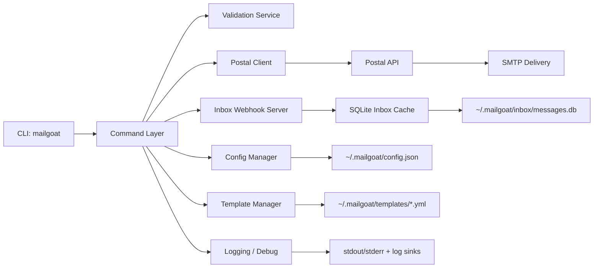

# MailGoat Architecture

Related docs:
- [API Reference](./api-reference.md)
- [Guides](./guides/)
- [Troubleshooting Advanced](./troubleshooting-advanced.md)

## System Overview

## Component Interactions

- `src/index.ts`: Global flags, command registration.
- `src/commands/*`: CLI command orchestration.
- `src/lib/validation-service.ts`: Input validation.
- `src/lib/template-manager.ts`: Handlebars rendering and template storage.
- `src/lib/postal-client.ts`: HTTP client for Postal API.
- `src/lib/inbox-webhook.ts`: Webhook ingestion.
- `src/lib/inbox-store.ts`: SQLite persistence/querying.

## Send Data Flow

1. CLI parses options.
2. Config is loaded/validated.
3. Templating applied (if requested).
4. Attachments prepared (MIME, base64, size checks).
5. Payload sent to Postal API.
6. Result returned as text or JSON.

## Receive Data Flow (Webhook Mode)

1. `mailgoat inbox serve` starts HTTP listener.
2. Postal webhook posts message metadata.
3. Webhook parser normalizes payload.
4. Record persisted to SQLite inbox cache.
5. `mailgoat inbox list/search` reads from cache.

## Storage Layout

- Config: `~/.mailgoat/config.json`
- Templates: `~/.mailgoat/templates/*.yml`
- Inbox cache: `~/.mailgoat/inbox/messages.db`
- Logs: configured via logger settings and environment.

## Extension Points

Future plugin architecture can attach at:
- Pre-send hooks (policy checks, enrichment).
- Post-send hooks (analytics, custom audit sinks).
- Webhook handlers (custom parsing/routing).
- Additional providers (beyond Postal).
